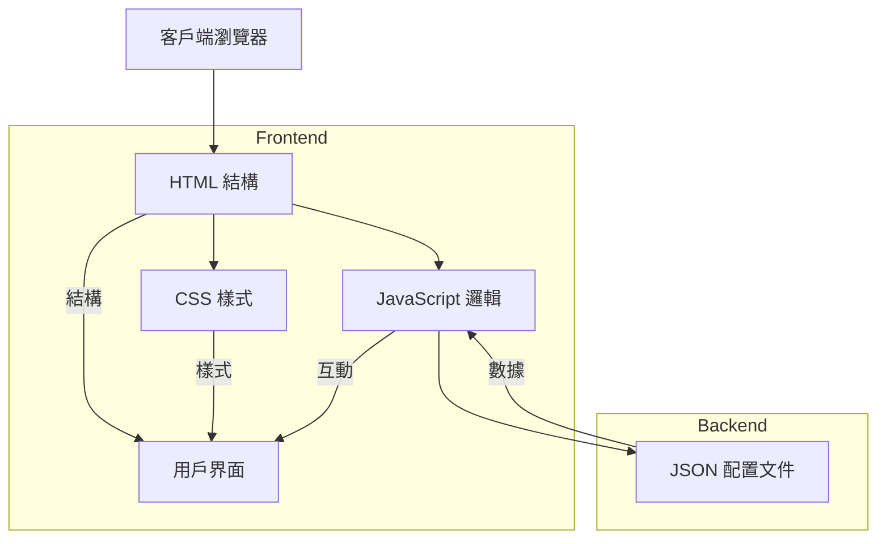
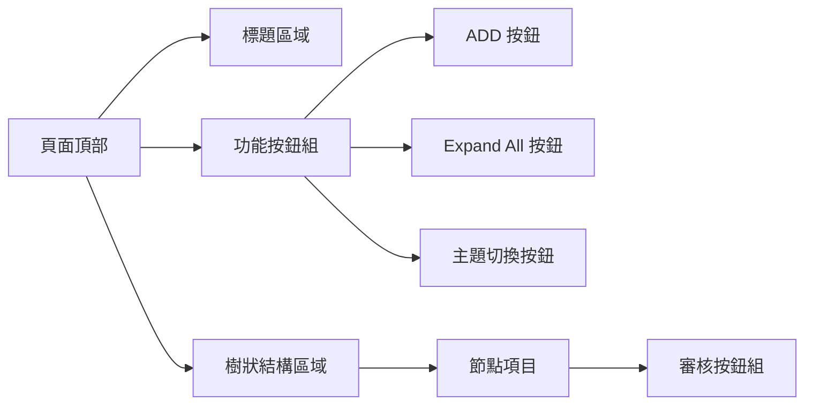
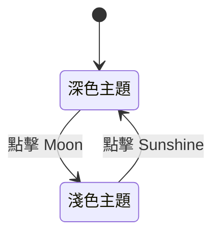
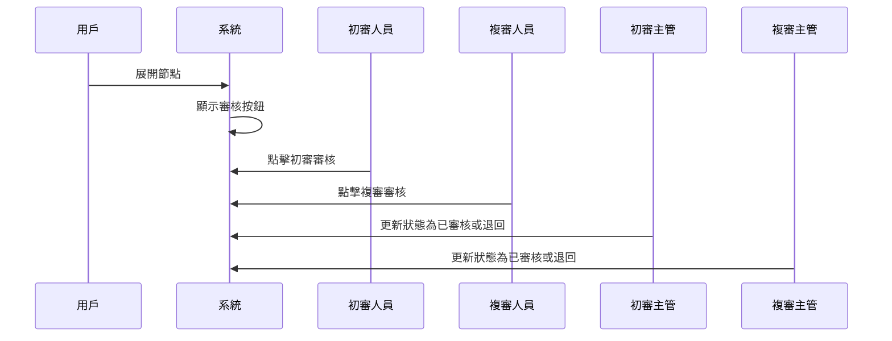

# 政府標單或法人採購標案 - 印鑑用印前申請之檢核表


 

## 系統架構文件

## 目錄
- [系統概述](#系統概述)
- [功能特點](#功能特點)
- [技術架構](#技術架構)
- [資料結構](#資料結構)
- [用戶界面](#用戶界面)
- [系統流程](#系統流程)
- [安全性考慮](#安全性考慮)
- [相關文件](#相關文件)

## 系統概述

本系統是一個用於管理政府標單或法人採購標案印鑑用印前申請的檢核系統。系統提供了一個互動式的樹狀結構界面，支持多層級的審核流程和主題切換功能。

### 主要目標
- 提供清晰的檢核項目層級結構
- 實現多層級的審核流程
- 支持直觀的用戶界面操作
- 確保審核流程的完整性和可追踪性

## 功能特點

### 1. 樹狀結構管理
- 支持多達 5 層的項目層級
- 可展開/收合的節點結構
- 預設展開到第二層級

### 2. 審核功能
- 初審主管審核機制
- BU Head 審核機制
- 審核狀態可視化
- 審核退回功能

### 3. 用戶界面功能
- 深色/淺色主題切換
- 一鍵展開/收合所有項目
- 響應式設計適配

## 技術架構



### 使用的技術棧
- **前端框架**: 原生 JavaScript
- **樣式框架**: Bootstrap 4.5.2
- **圖標**: Font Awesome 6.0.0
- **數據格式**: JSON
- **日期選擇器**: Flatpickr

## 資料結構

### JSON 結構示例
```json
{
  "level": "0",
  "title": "根節點",
  "children": [
    {
      "level": "1",
      "title": "一級節點",
      "children": [
        {
          "level": "2",
          "title": "二級節點",
          "signchildren": [
            {
              "show": "Y",
              "signlevel": "1",
              "Y/N/NA": null
            }
          ]
        }
      ]
    }
  ]
}
```

## 用戶界面

### 界面組件


### 主題切換


## 系統流程

### 審核流程


## 安全性考慮

### 數據安全
- 所有操作在前端執行，無敏感數據傳輸
- JSON 配置文件僅包含結構數據
- 無用戶個人信息存儲

### 操作安全
- 審核操作具有防誤觸機制
- 退回操作需二次確認
- 界面操作具有視覺反饋

## 相關文件

### ID 生成策略文件
- 文件路徑：[./ID.md](./ID.md)
- 文件說明：
  - 詳細描述了系統中 ID 的生成規則和格式
  - 包含初審和複審的 ID 格式範例
  - 提供了實際案例的完整說明
  - 包含代碼使用示例
  - 說明了如何正確處理簽核層級的 ID 格式
- 目的：為了以後回寫 JSON 保存成一個完整的標案文檔

### ID 文件的重要性
1. **格式統一性**：
   - 確保所有元素 ID 的格式一致
   - 避免使用不規範的 ID 格式（如 `LN1-2`）

2. **資料追踪**：
   - 便於追踪節點在 JSON 結構中的位置
   - 確保資料回寫的準確性

3. **維護性**：
   - 提供清晰的 ID 命名規範
   - 降低代碼維護的難度

4. **擴展性**：
   - 支持未來可能的系統擴展
   - 預留了更多層級審核的可能性

## 後續優化建議

1. **功能擴展**
   - 添加數據持久化功能
   - 實現多用戶協作機制
   - 添加審核歷史記錄

2. **性能優化**
   - 實現數據緩存機制
   - 優化大量數據的渲染性能
   - 添加懶加載功能

3. **用戶體驗**
   - 添加操作引導功能
   - 優化移動端適配
   - 增加快捷鍵支持
